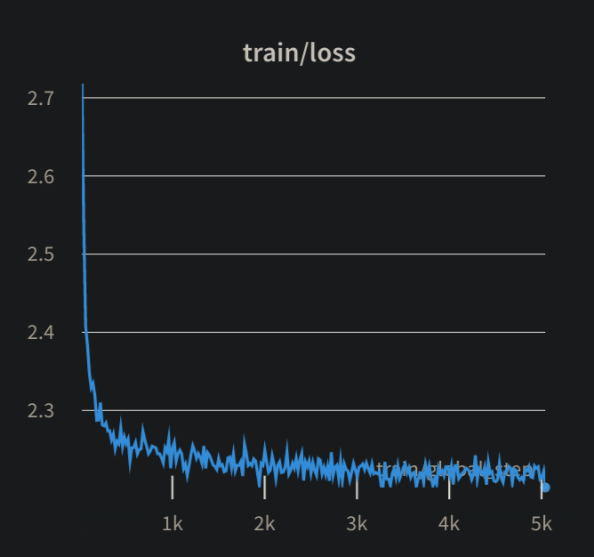
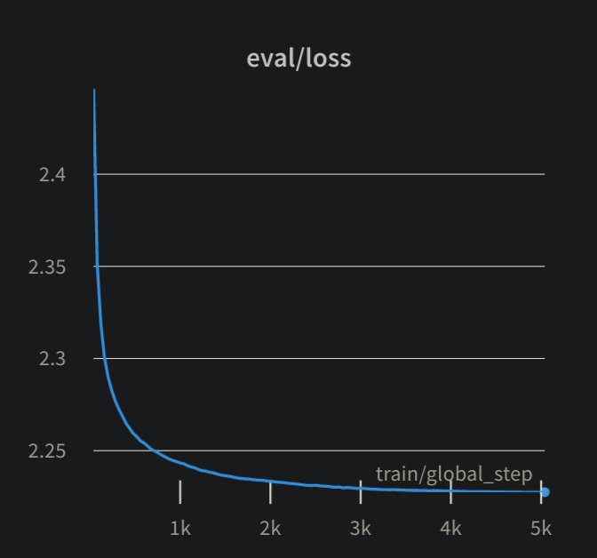

# Vicuna-LoRa-Medical

This repository contains a fine-tuned version of Vicuna 7B, optimized for the medical domain using Low Rank Adaptations(LoRa) . The model was fine tuned on a subset of [wikimed](https://zenodo.org/record/5755155) dataset which contains 393,618 Wikipedia page texts related to medical domain. For fine tuning this model, a subset of 25000 articles were used which contains around 27.5 million tokens.

### FINE TUNING SETTINGS

| Parameter                   | Value           |
|-----------------------------|-----------------|
| Total Training Parameters   |      4,194,304  |
| Num Train Epochs            |             3   |
| Per Device Train Batch Size |             8   |
| Optimizer                   |         adamw   |
| Gradient Accumulation Steps |            16   |
| Weight Decay                |          0.01   |
| Learning Rate               |       0.00005   |
| Block Size                  |           128   |
| LoRA Rank                   |             8   |
| LoRA Alpha                  |            16   |
| LoRA Dropout                |           0.1   |

The Model was fine tuned on a single Nvidi A100 gpu for 7hrs.


 

 

## MODEL ASSESMENT

The model was evaluated on the test set of [PubMedQA](https://arxiv.org/abs/1909.06146).PubMedQA is a dataset for Biomedical Research Question Answering. The task of PubMedQA is to answer research questions with yes/no/maybe based on the given Research papers abstract.
<br>

3 shot performance on PubMedQA Test Set without outputs processing to the task.

|    Model        |   Accuracy   | Macro F1-Score |
|-----------------|--------------|----------------|
|   Vicuna-Base   |    11.8%     |     2.69%      |
|   Vicuna-LoRa   |     24%      |      4.32%     |

<br>
3 shot performance on PubMedQA Test Set with outputs processing to the task.

|    Model        |   Accuracy   | Macro F1-Score |
|-----------------|--------------|----------------|
|   Vicuna-Base   |    20.6%     |     6.33%      |
|   Vicuna-LoRa   |    57.8%     |      13.25%    |

The post-processing involved removing any outputs containing punctuation marks and converting the words to lowercase, aligning them with the target labels.The same post-processing steps were applied to both the base model and the fine-tuned model, ensuring a fair comparison.

The precision & recall of the fine tuned model for the yes & no class label instances improved , but had difficulty for instances where there is ambiguity ('maybe' class label instances). Also both the base model & the fine tuned model predictions were senstitive to prompts ,so further prompt engineering is necessary to find a suitable prompt template for the task.

## SUMMARY & FUTURE PROSPECTS

The fine-tuning of Vicuna 7B using the parameter-efficient technique LoRa has shown promising improvements in model performance for the medical domain. However, further fine-tuning on larger and more diverse datasets in medical domain like reserach papers , , along with longer training on a multi-GPU setup, is required to achieve even better results. Looking ahead, the project has the potential to be extended to even more powerful models such as the 13B or 30 billion parameter models, which are expected to deliver enhanced performance in the medical domain. This progress indicates that the current fine-tuning approach is on the right track and holds promise for establishing a foundational model for the medical domain.


#### Prompt Template used for evaluation of the model on PubMedQA test set

```
 your task is to answering research questions relating to medical domain using yes/no/maybe responses. Answer as yes if the context supports the question , answer as no if the context does not support the question , answer as maybe if the context is not clear enough to answer the question.      

    ###
            
    Context: Research involving dogs has been instrumental in advancing our understanding of various scientific fields. Dogs are highly trainable and sociable animals.

    Question: Are dogs trainable?

    Answer: yes

    ###

    Context: Research involving dogs has been instrumental in advancing our understanding of various scientific fields. Dogs are highly trainable and sociable animals.

    Question: Can dogs be trained to detect and alert individuals to the presence of specific allergens?

    Answer: maybe

    ###

    Context: Research involving dogs has been instrumental in advancing our understanding of various scientific fields. Dogs are highly trainable and sociable animals.

    Question: Are Dogs highly introverted & reserved ?

    Answer: no 

    ###

    Context:
    {Context}

    Question:
    {Question}

    Answer: 
    
    """
```
